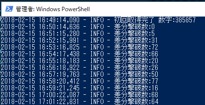
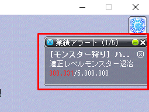

## このツールについて
メイプルストーリーの分間MOB撃破数をログに表示するだけのツール。  
戦闘分析は経験値しか表示されず、簡単に効率計算ができるMOB撃破数が知りたかったため作成。  

## 仕組み
業績アラートに表示される、「[モンスター狩り]ハンターの本能」のMOB撃破数を1分毎に画像解析し、分間撃破数を取得する。  

## 導入手順（結構長い）
1. python3系 **64bit版**をインストール
    * https://www.python.org/downloads/release/python-363/
        * 64bitをインストールするため、サイト下部の「Windows x86-64 executable installer」をダウンロードし、インストール
        * インストール時、「Add Python3.x to PATH」に必ずチェックを入れる
1. pywin32をインストール(pythonでwindowsAPIを実行するために必要)
    * https://sourceforge.net/projects/pywin32/files/pywin32/Build%20221/
        * 「pywin32-221.win-amd64-py3.6.exe」をダウンロードし、インストール
1. Visual C++ 2015 Build Toolsのインストール（pythonパッケージの導入に必要）
    * http://landinghub.visualstudio.com/visual-cpp-build-tools
        * サイト上部の「Download Visual C++ Build Tools 2015」をクリックし、ダウンード、インストール 
1. 本ツールをダウンロード、適当なフォルダに配置
    * https://github.com/socket1016/maple_python_tools/archive/master.zip
1. 依存パッケージのインストール
    1. スタート→powershell（もしくはコマンドプロンプト）を開き、4で配置したフォルダに移動（移動コマンド: `cd C:\xxx\maple_python_tools`）
    1. コマンド`pip install -r ./requirements.txt`と入力し実行（5分ほどかかる）

## 動作確認
1. メイプル上で、「[モンスター狩り]ハンターの本能」のみを表示した業績アラートを右上に配置
    * ちょうどスキルアイコンの下、右端は画面右端にくっつける
1. powershell（もしくはコマンドプロンプト）を**管理者権限**で実行し、導入手順4で配置したフォルダに移動（移動コマンド: `cd C:\xxx\maple_python_tools`）
1. コマンド`python ./count_killed_enemies.py`と入力し実行
1. 数値が取得できていれば成功 